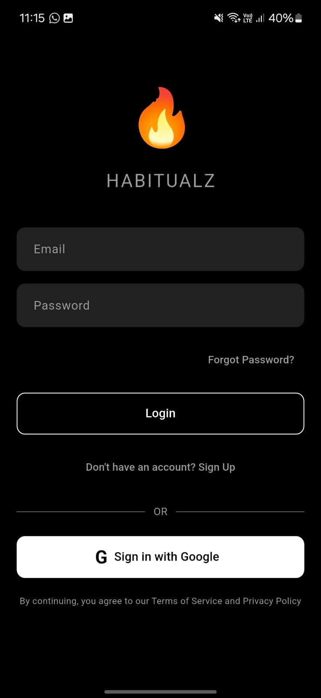
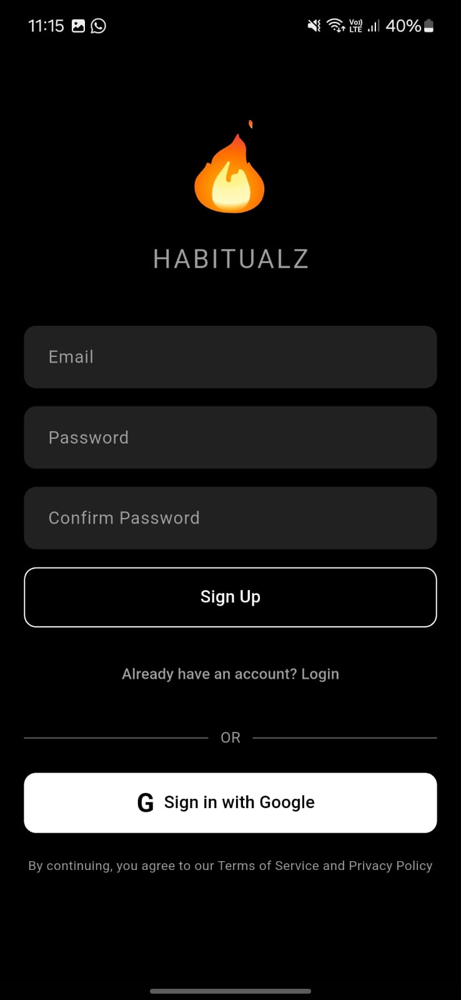
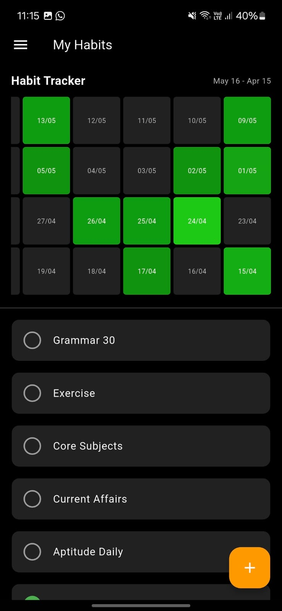
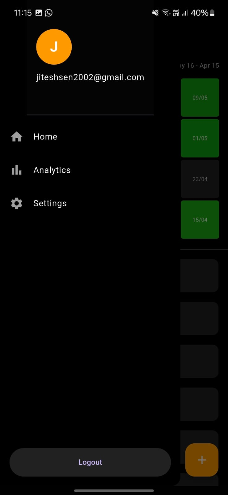
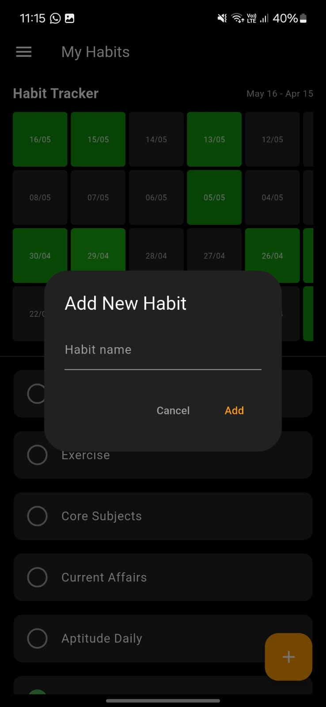
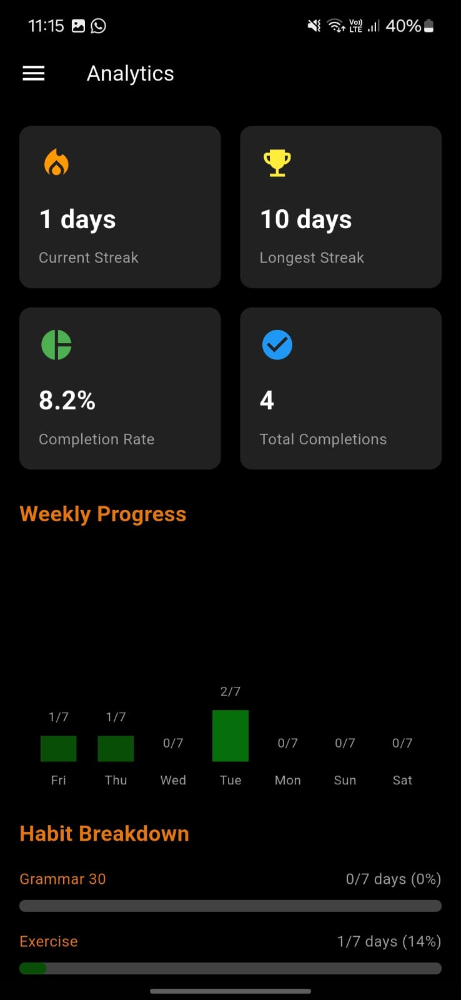
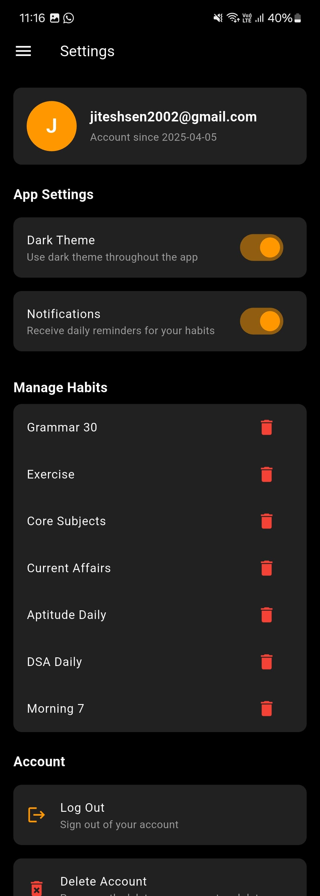
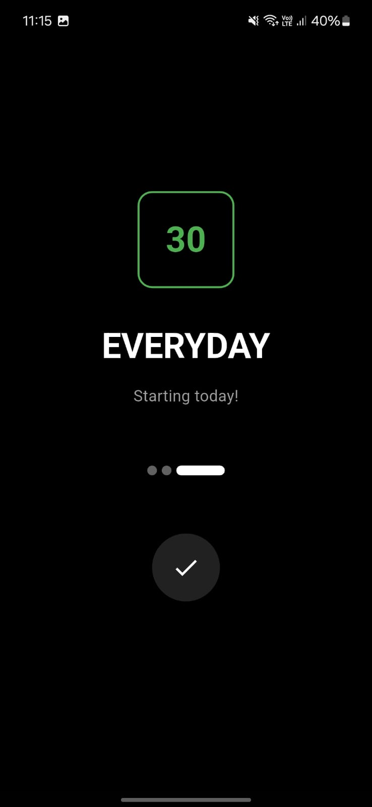

Habitualz - Habit Tracking App

Live Demo
Check out the live demo: https://habitualz-531f2.web.app
Overview
Habitualz is a comprehensive habit tracking application designed to help users build and maintain positive habits through visual tracking, analytics, and customizable reminders. The app provides an intuitive interface for daily habit monitoring with powerful visualization tools to keep users motivated.
Features
Authentication & User Management

Firebase Authentication: Secure email/password login and registration
Account Recovery: Password reset functionality via email
Profile Management: Update profile information and account settings
Account Deletion: Complete user data removal option

Habit Tracking

Daily Check-ins: Mark habits as complete with a simple tap
Habit Categories: Organize habits by category (health, productivity, learning, etc.)
Custom Habits: Create personalized habits with descriptions and frequency
Streak Tracking: Monitor consecutive days of habit completion
Reminder System: Customizable notifications for habit completion

Analytics & Visualization

Interactive Heatmap: Visual representation of habit consistency over time
Streak Analytics: View current and best streaks for motivation
Completion Rate: Percentage-based success metrics
Progress Trends: Charts showing improvement over days, weeks, and months

UI/UX Features

Theme Customization: Toggle between light and dark themes
Responsive Design: Optimized for various screen sizes
Intuitive Navigation: Easy-to-use interface with gesture support
Offline Support: Continue tracking habits without internet connection

Technologies Used

Flutter & Dart: Cross-platform framework for the frontend
Firebase Authentication: User authentication and management
Cloud Firestore: Real-time database for habit and user data
Firebase Analytics: App usage and performance monitoring
Provider Pattern: State management

Screenshots

  
  
  
  
  
  
  
  
  
  

Installation

Clone this repository

bashgit clone https://github.com/jiteshh-10/habitualz.git

Navigate to the project directory

bashcd habitualz

Install dependencies

bashflutter pub get

Run the app

bashflutter run
Future Enhancements

Social habit sharing and challenges
Integration with health apps
Extended analytics with machine learning insights
Gamification elements for increased motivation

Contribution
Contributions, issues, and feature requests are welcome. Feel free to check the issues page if you want to contribute.
License
This project is licensed under the MIT License - see the LICENSE file for details.
